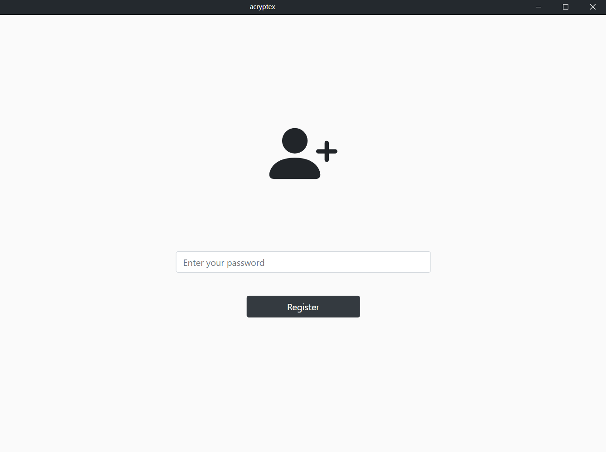
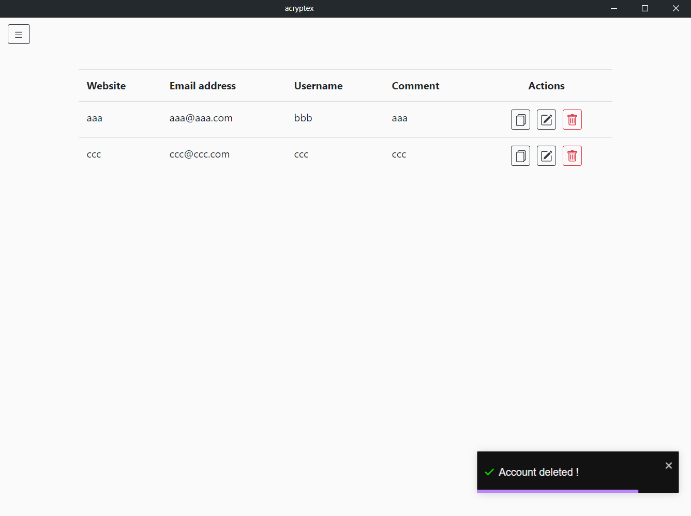

<!--
*** Thanks for checking out this README Template. If you have a suggestion that would
*** make this better, please fork the repo and create a pull request or simply open
*** an issue with the tag "enhancement".
*** Thanks again! Now go create something AMAZING! :D
-->

<!-- PROJECT SHIELDS -->
<!--
*** I'm using markdown "reference style" links for readability.
*** Reference links are enclosed in brackets [ ] instead of parentheses ( ).
*** See the bottom of this document for the declaration of the reference variables
*** for contributors-url, forks-url, etc. This is an optional, concise syntax you may use.
*** https://www.markdownguide.org/basic-syntax/#reference-style-links
-->

<!-- PROJECT LOGO -->
<br />
<p align="center">
    

  <h3 align="center">acryptex</h3>

  <p align="center">
    Password Manager
    <br />
</p>

<!-- TABLE OF CONTENTS -->

## Table of Contents

- [About the Project](#about-the-project)
  - [Built With](#built-with)
- [Getting Started](#getting-started)
  - [Prerequisites](#prerequisites)
  - [Installation](#installation)
- [Screenshots](#screenshots)
- [Roadmap](#roadmap)
- [Contributing](#contributing)
- [License](#license)
- [Contact](#contact)

## About The Project

This is a password manager. Store your accounts information into a crypted local file. Lock/unlock this file with a secret password.

### Built with

- [Electron](https://www.electronjs.org/)
- [Electron-forge](https://github.com/electron-userland/electron-forge)
- [Node](https://nodejs.org/en/about/)
- [React](https://github.com/facebook/react)
- [Typescript](https://www.typescriptlang.org/)
- [Redux](https://redux.js.org/)
- [Bootstrap](https://getbootstrap.com/)
- [Webpack](https://github.com/webpack/webpack)
- [Frameless titlebar](https://github.com/Cristian006/frameless-titlebar)
- [react-aria-offcanvas](https://github.com/neosiae/react-aria-offcanvas)
- [react-toastify](https://github.com/fkhadra/react-toastify)
- [Best README Template](https://github.com/othneildrew/Best-README-Template)

<!-- GETTING STARTED -->

## Getting Started

To get a local copy up and running follow these next steps.

### Prerequisites

This project requires Node, yarn and git installed.

### Installation

1. Clone the repo

```sh
git clone https://github.com/Arsero/acryptex.git
```

2. Install NPM packages

```sh
yarn install
```

3. Start the application

```sh
yarn start
```

4. Build an installer (see the out folder)

```sh
npm run make *not available*
```

## Screenshots

### Login page

<p align="center">
    
</p>

### Register page

<p align="center">
    
</p>

### Main page

<p align="center">
    
</p>

### Account form

<p align="center">
    
</p>

### Notify

<p align="center">
    
</p>

<!-- ROADMAP -->

## Roadmap

See the [open issues](https://github.com/Arsero/acryptex_old/issues) for a list of proposed features (and known issues).

- Add splash screen
- Add OAuth to store file in dropbox / drive / ...

<!-- CONTRIBUTING -->

## Contributing

Contributions are what make the open source community such an amazing place to be learn, inspire, and create. Any contributions you make are **greatly appreciated**.

1. Fork the Project
2. Create your Feature Branch (`git checkout -b feature/your-feature`)
3. Commit your Changes (`git commit -m 'Add some your-feature'`)
4. Push to the Branch (`git push origin feature/your-feature`)
5. Open a Pull Request

## License

Distributed under the MIT License. See `LICENSE` for more information.

<!-- CONTACT -->

## Contact

[Arsero](https://github.com/Arsero) - azzedine.elb@outlook.com

Project Link: [https://github.com/Arsero/acryptex](https://github.com/Arsero/acryptex)

<!-- ACKNOWLEDGMENTS -->

## Acknowledgments

- [HunteRoi](https://github.com/HunteRoi)
- [Gservais](https://github.com/Gservais)
